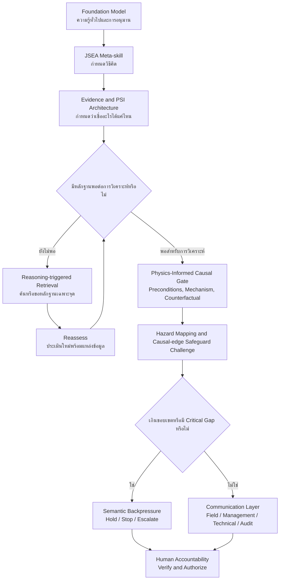

# JSEA Future Development

## จาก AI ผู้ช่วยทำ JSA สู่ Governed Reasoning Architecture

**วันที่จัดทำ:** 15 สิงหาคม 2026  
**ปรับปรุงล่าสุด:** 16 สิงหาคม 2026 หลังติดตั้ง P3.2-PICR Wave 1  
**สถานะเอกสาร:** Strategic direction and future recommendation  
**เอกสารที่เกี่ยวข้อง:** `JSEA_implementation plan`, `JSEA_model_reasoning_capability_report.md`, `P3.2_physics_informed_causal_reasoning_layer_plan.md` และ `P3.2_physics_informed_causal_reasoning_layer_implementation_report.md`  
**แนวคิดต้นทาง:** บทสนทนา “JSEA Model Reasoning Capability” (`6a807982-d74c-83ec-8912-d5ddce85f514`)

## 1. จุดประสงค์ของเอกสาร

เอกสารนี้บันทึกเส้นทางของโครงการ JSEA ตั้งแต่จุดเริ่มต้นจนถึงสถานะปัจจุบัน สรุปสิ่งที่เราเรียนรู้จากการพัฒนา และเสนอทิศทางในอนาคต

เป้าหมายไม่ใช่เพียงเพิ่มฟังก์ชันให้ AI เขียนตาราง JSA ได้ละเอียดขึ้น แต่คือการพัฒนาระบบที่ช่วยให้โมเดลภาษาใช้ความสามารถในการให้เหตุผลอย่างมีวินัยภายใต้บริบทที่ข้อมูลอาจไม่ครบ หลักฐานอาจขัดแย้ง และอำนาจตัดสินใจยังต้องเป็นของมนุษย์

## 2. Thesis ของโครงการ

สิ่งที่โครงการกำลังสร้างไม่ใช่เพียง “AI สำหรับทำ JSA” แต่เป็นการทดลองสร้าง **Reasoning Architecture สำหรับงานที่คำตอบขึ้นกับบริบท หลักฐาน และขอบเขตอำนาจของมนุษย์**

> **JSEA provides a governed meta-skill architecture that enables a capable foundation model to reason across unfamiliar safety tasks, recognize decision-critical unknowns, seek evidence when needed, challenge unsupported assumptions, and preserve human authority over safety-critical decisions.**

ในภาษาทั่วไป:

> **ระบบไม่จำเป็นต้องรู้ทุกคำตอบตั้งแต่ต้น แต่ต้องรู้ว่าจะคิดอย่างไร รู้เมื่อใดว่ายังไม่รู้ รู้ว่าจะหาหลักฐานหรือส่งต่อให้ใคร และไม่ตัดสินใจแทนผู้มีอำนาจ**

Thesis นี้แข็งแรงกว่าคำกล่าวว่า “AI เขียน JSA ได้ดี” เพราะมุ่งวัดวิธีที่ระบบรับมือกับงานใหม่ ความไม่แน่นอน หลักฐาน และขอบเขตอำนาจ ไม่ได้วัดเพียงความสวยงามของคำตอบปลายทาง

## 3. มองย้อนเส้นทางที่ผ่านมา

### ระยะเริ่มต้น: ทำให้ AI มองอันตรายและท้าทายมาตรการ

โครงการเริ่มจากสองบทบาทหลัก:

- **Hazard Blind-Spot Mapper** ช่วยแตกขั้นตอนงานและค้นหาอันตรายที่อาจถูกมองข้าม
- **Safeguard Challenge Assistant** ช่วยตรวจว่ามาตรการควบคุมชัดเจน ตรงกับกลไกอันตราย มีหลักฐาน และตรวจสอบได้หรือไม่

จุดเริ่มต้นนี้ทำให้ระบบทำได้มากกว่าการเติมตาราง แต่ยังมีคำถามสำคัญว่าโมเดลจะรับมืออย่างไรเมื่อข้อมูลกระบวนการไม่ครบ หรือเมื่อผู้ใช้ต้องการคำตอบเฉพาะที่ไม่มีหลักฐาน

### Layer 0: สร้างวินัยด้านหลักฐานและจุดหยุด

โครงการเพิ่ม Evidence Labels, PSI Gate, STOP_AND_ESCALATE และ Competent-role Routing เพื่อให้โมเดลแยกข้อเท็จจริงออกจากสมมติฐาน ตรวจพบข้อมูลสำคัญที่ขาด และไม่เดินหน้าต่ออย่างมั่นใจเมื่อยังไม่มีฐานรองรับ

นี่เป็นจุดเปลี่ยนจาก “ระบบที่พยายามตอบ” ไปเป็น “ระบบที่รู้ว่าเมื่อใดไม่ควรสรุป”

### Layer 1: เพิ่มความเข้าใจบริบทของ Process Safety

โครงการเพิ่ม Chemical Hazard Evidence, Process Conditions, Process Boundary, Isolation Adequacy, Re-JSEA Triggers และการส่งต่อบทบาทเฉพาะทาง ทำให้โมเดลมีเลนส์สำหรับมองงานเคมีและปิโตรเคมีอย่างเป็นระบบมากขึ้น

### P0 และ P1: ทำให้กฎและ Workflow สอดคล้องกัน

การแก้ Consistency และ Workflow Behavior ทำให้กฎจากหลาย reference ทำงานร่วมกันได้ดีขึ้น ลดความคลุมเครือเรื่องสถานะ หลักฐาน ลำดับการวิเคราะห์ และการยกระดับประเด็นสำคัญ

### P2: เริ่มทำให้ความสามารถตรวจสอบได้

Eval cases และ validation harness ทำให้โครงการมีข้อสอบที่อ่านได้ด้วยเครื่อง มีการตรวจ schema, ID, reference mirror, version และพฤติกรรมต้องห้าม นี่เป็นพื้นฐานสำคัญของการเปลี่ยนจาก prompt ที่ดูดีไปเป็นระบบที่ทดสอบและดูแลได้

### P3.1: สื่อสารผลเดียวกันให้เหมาะกับคนแต่ละกลุ่ม

Field Communication Behavior เพิ่ม FIELD_JSA, MANAGEMENT, TECHNICAL_REVIEW และ AUDIT_EVAL พร้อมกติกา Hazard-Control-PIC แบบ 1:1, Hold Point, plain Thai และการซ่อนรายละเอียดภายในจากรายงานหน้างาน

บทเรียนสำคัญคือ Presentation Layer ต้องไม่เปลี่ยน Safety Finding Layer การเขียนให้อ่านง่ายต้องไม่ทำให้ความรุนแรงของประเด็นลดลง

### P3.2-PICR Wave 1: เพิ่มแผนที่เหตุและผลทางฟิสิกส์และเคมี

โครงการเพิ่ม Physics-Informed Causal Reasoning Layer เพื่อให้โมเดลไม่เพียงระบุชื่ออันตราย แต่ต้องตรวจว่าเงื่อนไขของกลไกมีอยู่จริงหรือไม่ เชื่อมเหตุเริ่มต้นไปยัง Exposure หรือ Loss of Containment อย่างไร และหลักฐานใดจะยืนยันหรือหักล้างข้อสรุป

Wave 1 มี Claim Schema, Reasoning Policy, Source Register, Mechanism Catalog ห้ากลไก และบทสอบ Causal Reasoning 30 cases รวมอยู่ใน package รุ่น 1.4.0 แล้ว สถานะยังเป็น `DRAFT` เพราะการมี code และ reference ครบไม่เท่ากับการพิสูจน์ว่าโมเดลปฏิบัติตามได้ถูกต้องทุกครั้ง

## 4. สิ่งที่เราเรียนรู้

### 4.1 Knowledge ไม่เท่ากับ Meta-skill

โมเดลทั่วไปอาจรู้ว่า H2S เป็นพิษ Naphtha ไวไฟ หรือ LOTO คืออะไร แต่ความรู้เหล่านี้ไม่รับประกันว่าโมเดลจะเลือกใช้ข้อมูลถูกจุด รู้ว่าข้อมูลใดขาด หรือหยุดก่อนตัดสินใจเกินหลักฐาน

JSEA จึงทำหน้าที่ครอบ Foundation Model ด้วยวิธีทำงานของผู้เชี่ยวชาญ:

**Understand → Decompose → Reason → Challenge → Detect Unknowns → Retrieve Evidence → Reassess → Escalate → Communicate**

### 4.2 “รู้ว่าไม่รู้” เป็นพฤติกรรมทางวิศวกรรม

คำว่า “รู้ว่าไม่รู้” ในที่นี้ไม่ได้หมายถึง AI มี Self-awareness แต่หมายถึงระบบแสดงพฤติกรรมที่ตรวจสอบได้:

**Evidence insufficient → Do not conclude → Retrieve / Verify / Escalate**

ตัวอย่างคือข้อมูล “H2S ใน process ประมาณ 500 ppm” ไม่เท่ากับ “บรรยากาศที่คนหายใจเท่ากับ 500 ppm” ระบบต้องไม่ใช้สองค่านี้แทนกัน แต่ต้องระบุว่าต้องตรวจอะไรและใครเป็นผู้ยืนยัน

### 4.3 Retrieval เป็นส่วนหนึ่งของวงจรเหตุผล

สถาปัตยกรรมที่ต้องการไม่ใช่:

**Question → Search → Summarize**

แต่เป็น:

**Question → Reason → Discover evidence need → Retrieve targeted evidence → Integrate → Reassess**

นี่คือ **Reasoning-triggered Retrieval** การค้นเกิดขึ้นเพราะระบบพบว่าข้อสรุปบางอย่างต้องมีหลักฐาน ไม่ใช่ค้นทุกอย่างก่อนแล้วนำผลมาสรุปโดยไม่รู้ว่ากำลังพิสูจน์อะไร

### 4.4 การหยุดตอบเป็นความสามารถ ไม่ใช่ความล้มเหลว

`EVIDENCE_GAP`, `STOP_AND_ESCALATE`, Hold Point และ Human Accountability Lock ทำหน้าที่คล้าย **Epistemic Braking System** ช่วยต้านแรงผลักของโมเดลที่มักต้องการตอบให้ครบ

ในงาน Safety-critical คำตอบที่มีคุณภาพอาจเป็น “ยังระบุมาตรการนี้ไม่ได้” หรือ “ยังไม่พร้อมเข้าสู่การอนุมัติงาน” หากข้อมูลที่ใช้ตัดสินใจยังไม่ครบ

### 4.5 Human Authority ต้องอยู่ใน Architecture ไม่ใช่ Disclaimer ท้ายรายงาน

การระบุว่า AI ไม่อนุมัติงานไม่ควรเป็นเพียงข้อความเตือน แต่ต้องส่งผลต่อ Workflow จริง เช่น ห้ามสรุป Safeguard Adequacy เมื่อ PSI ขาด ต้องกำหนด Hold Point และต้อง Route ไปยังผู้มีอำนาจที่เหมาะสม

### 4.6 Context-aware ไม่ใช่เพียงการอ่านข้อความได้มาก

การตอบตามบริบทอย่างแท้จริงหมายถึงระบบรู้ว่า **ข้อเท็จจริงใดมีผลต่อข้อสรุป และเมื่อข้อเท็จจริงนั้นเปลี่ยน ข้อสรุปส่วนใดต้องเปลี่ยนตาม**

ตัวอย่างงานล้าง Acid Sump ด้วย Sodium Hypochlorite:

```text
มีกรดตกค้าง + เติม NaOCl โดยตรง
-> เกิดปฏิกิริยาและก๊าซคลอรีน
-> ก๊าซสะสมในบ่อและพื้นที่ต่ำ
-> คนงานได้รับสัมผัส
```

โมเดลทั่วไปอาจรู้กฎว่า “Bleach ห้ามผสมกรด” อยู่แล้ว สิ่งที่ PICR เพิ่มคือการบังคับให้ตรวจ Preconditions, Causal Pathway, Unknowns และ Disconfirming Evidence หากกรดถูกถ่ายออกและยืนยันสภาพใหม่ตามเกณฑ์ที่อนุมัติ กลไกเดิมต้องถูกลดระดับหรือปฏิเสธ แต่หากเพียงเปลี่ยนหน้ากากโดยยังผสมสารเหมือนเดิม ข้อสรุปเรื่องต้นเหตุต้องไม่เปลี่ยน

| ก่อนมี PICR | หลังมี PICR |
|---|---|
| มีแนวโน้มเตือนจากความรู้หรือ Keyword | ต้อง Activate จาก Preconditions และสภาพงาน |
| อาจรวม Hazard และ Control เป็นคำแนะนำทั่วไป | ต้องระบุว่า Control ตัด causal edge จุดใด |
| อาจเน้นหาเหตุผลสนับสนุนอันตราย | ต้องค้นทั้งหลักฐานสนับสนุนและหลักฐานที่หักล้าง |
| Unknown อาจถูกเติมด้วยคำตอบที่ดูสมเหตุผล | Unknown ต้องกลายเป็น Evidence Need หรือ Specialist Route |
| บริบทเปลี่ยนแต่คำเตือนอาจยังเหมือนเดิม | Counterfactual ที่สำคัญต้องเปลี่ยน Support State ตาม |

PICR จึงไม่รับประกันว่าโมเดลจะพบอันตรายที่ไม่เคยรู้มาก่อนเสมอไป แต่ตั้งเป้าให้การนำความรู้มาใช้ **ตรงบริบท ตรวจสอบย้อนกลับ และสม่ำเสมอขึ้น** ซึ่งต้องพิสูจน์ด้วยผลทดสอบ ไม่ใช่จากการอ่าน configuration

## 5. สถาปัตยกรรมปัจจุบัน



สถาปัตยกรรมนี้ยังเป็น **Model-guided reasoning harness** ไม่ใช่ Formal Reasoning Engine, Physics Simulator หรือ Deterministic Safety Calculator ผลลัพธ์จึงยังขึ้นกับรุ่นโมเดล การตั้งค่า บริบท เครื่องมือ และคุณภาพข้อมูลนำเข้า

## 6. สถานะปัจจุบันของหลักฐาน

| ระดับ | สิ่งที่มีแล้ว | สิ่งที่ยังขาด |
|---|---|---|
| Configuration | Skills, references, PSI/PICR gates, escalation และ output contract รุ่น 1.4.0 | การบังคับใช้บางข้อยังอาศัย instruction-following ของโมเดล |
| Structural validation | ตรวจ causal schema, paths, mirrors, IDs, sources, forbidden actions และ 98 eval contracts | ไม่ได้ตรวจความถูกต้องทางวิศวกรรมของคำตอบ |
| Behavior cases | มี 68 cases เดิมและ PICR 30 cases พร้อม expected, prohibited และ pass/fail behavior | ยังไม่มี automated semantic judge ที่ผ่าน calibration |
| Demonstration | มีตัวอย่างงานกรดร้อน H2S/Naphtha และ Acid Sump/NaOCl | ยังไม่ใช่ controlled A/B และจำนวนรอบยังน้อย |
| Human validation | มี Human Authority อยู่ใน design | ยังไม่มี blinded expert scoring และ field pilot ที่เป็นระบบ |
| Model portability | Architecture ออกแบบให้ใช้กับ capable model | ยังไม่ได้เทียบหลายโมเดล หลาย reasoning level และหลาย tool condition |

## 7. Future Development Recommendations

### P3.2-Q: Semantic Qualification of Physics-Informed Causal Reasoning

**เป้าหมาย:** พิสูจน์ว่าโมเดลแสดงวงจรเหตุผลที่ตั้งใจไว้อย่างสม่ำเสมอ และ PICR เพิ่มคุณภาพเหนือ Baseline จริง ไม่ใช่เพียงทำให้คำตอบดูเป็นเทคนิคมากขึ้น

สิ่งที่ควรสร้าง:

- Semantic evaluation runner ที่เรียกโมเดล บันทึกคำตอบ และให้คะแนนตาม rubric
- Controlled A/B ระหว่าง configuration ก่อนมี PICR กับรุ่น 1.4.0 โดยตรึง Model, Prompt Input, Tool Access และ Sampling Settings ให้เหมือนกัน
- Golden cases ที่ผ่านการทบทวนโดย Process Safety, Operations, Occupational Hygiene และ Maintenance
- Counterfactual pairs เช่น เคสเดียวกันแต่เปลี่ยนสาร ความดัน Isolation หรือ Evidence availability เพียงหนึ่งจุด
- Causal scoring แยก Precondition Match, Causal-link Completeness, Disconfirming Evidence, Support-state Accuracy และ Control-to-edge Mapping
- Adversarial cases ที่มีข้อมูลหลอก ข้อมูลขัดแย้ง Production pressure และคำขอให้ AI อนุมัติงาน
- Repeated runs เพื่อวัดความสม่ำเสมอ ไม่ตัดสินจากคำตอบครั้งเดียว
- Blinded human review เพื่อลดอคติจากการรู้ชื่อโมเดลหรือ prompt version

**Gate ก่อนผ่าน:** ไม่มี Critical Hazard Miss ในชุด Safety-critical gate, ไม่มี Safe-to-proceed declaration, Negative Cases ไม่ถูก Over-trigger, Counterfactual เปลี่ยนสถานะถูกทิศทาง และ Unsupported Specificity อยู่ต่ำกว่าเกณฑ์ที่ Governance Owner อนุมัติ

### P3.3: Evidence-seeking and Retrieval Qualification

**เป้าหมาย:** พิสูจน์ว่าระบบค้นเมื่อจำเป็น ค้นถูกเรื่อง ใช้แหล่งเหมาะสม และไม่ยกระดับข้อมูลทั่วไปเป็นข้อกำหนดของโรงงาน

สิ่งที่ควรสร้าง:

- Explicit Evidence Need record ระบุ claim ที่ต้องพิสูจน์ แหล่งที่ต้องการ และเหตุผลที่ต้องค้น
- Source hierarchy enforcement: Site-approved source → legal/official source → recognized technical source → generic guidance
- Query and retrieval trace ที่ตรวจได้โดยไม่เปิดเผย Chain of Thought
- Citation entailment check ว่าแหล่งที่อ้างรองรับข้อความจริง
- Source freshness, jurisdiction และ document-version checks
- Conflicting-evidence behavior tests ที่ระบบต้องหยุดสรุปและส่งต่อ
- Prompt-injection resistance สำหรับเอกสารหรือเว็บที่ถูกดึงเข้ามา

**Gate ก่อนผ่าน:** ระบบค้นตรง Evidence Need, อ้างแหล่งที่รองรับ claim, แยก generic guidance จาก site requirement และไม่ทำตามคำสั่งแปลกปลอมในเอกสารที่ค้นมา

### P3.4: Model Portability and Robustness

**เป้าหมาย:** แยกให้ได้ว่าส่วนใดเป็นคุณสมบัติของ JSEA Architecture และส่วนใดขึ้นกับโมเดลเฉพาะรุ่น

สิ่งที่ควรทดสอบ:

- อย่างน้อยสองระดับความสามารถของโมเดล
- Tool-enabled เทียบกับ Tool-disabled
- บริบทครบ เทียบกับบริบทขาด และบริบทขัดแย้ง
- ภาษาไทย ภาษาอังกฤษ และข้อมูลผสมสองภาษา
- รอบรันซ้ำด้วย configuration เดียวกัน
- Model upgrade regression ก่อนเปลี่ยนรุ่นใน Production

ผลลัพธ์ควรเป็น Capability Envelope ระบุว่าโมเดลใดเหมาะกับงานระดับใด ต้องใช้เครื่องมืออะไร และงานใดต้อง Route ไปยังโมเดลหรือผู้เชี่ยวชาญที่สูงกว่า

### P3.5: Separate Analysis State from Presentation State

**เป้าหมาย:** ป้องกันไม่ให้การเขียนให้อ่านง่ายทำให้หลักฐานหรือข้อกังวลสำคัญหายไป

ข้อเสนอเชิงสถาปัตยกรรม:

- สร้าง Structured Analysis Object กลางก่อนสร้างรายงาน
- เก็บ Job Step, Hazard Mechanism, Evidence Status, Control Objective, PIC, Hold Point และ Source Reference เป็น field ที่ตรวจได้
- ให้ FIELD_JSA, MANAGEMENT, TECHNICAL_REVIEW และ AUDIT_EVAL render จาก Analysis Object เดียวกัน
- เพิ่ม cross-profile invariant tests ว่าข้อค้นพบสำคัญและสถานะ escalation ต้องเหมือนกันทุก profile

แนวทางนี้จะลดการพึ่งพา prompt เพียงชั้นเดียว และทำให้ audit, comparison และ application integration ง่ายขึ้น

### P3.6: Human Evaluation and Field Usability

**เป้าหมาย:** ตรวจว่าคำตอบที่ถูกเชิงเทคนิคถูกใช้ได้จริงโดยคนหน้างาน

สิ่งที่ควรทำ:

- ให้ผู้เชี่ยวชาญให้คะแนน Hazard recall, Control relevance, Evidence discipline และ Escalation correctness
- ให้ช่างและหัวหน้างานทดสอบว่าอ่านแล้วรู้ “ทำอะไร ตรวจอะไร หยุดตรงไหน และใครรับผิดชอบ” หรือไม่
- วัดเวลาทบทวน จำนวนคำถามติดตาม และจุดที่ผู้ใช้ตีความผิด
- เก็บ disagreement ระหว่าง AI กับผู้เชี่ยวชาญเป็น learning cases
- ห้ามใช้ผู้ประเมินเพียงกลุ่มเดียวเป็นทั้งผู้เขียนเฉลยและผู้ตัดสินทุกเคส

**Gate ก่อน Field Pilot:** ผู้เชี่ยวชาญยอมรับ critical-hazard coverage และผู้ใช้หน้างานผ่าน comprehension test ตามเกณฑ์ที่องค์กรกำหนด

### P4: Controlled Site Pilot

**เป้าหมาย:** ทดลองใน Workflow จริงโดยยังไม่ให้ AI เป็นผู้อนุมัติหรือควบคุมงาน

รูปแบบ Pilot ที่แนะนำ:

- เริ่มจาก Offline Pre-job Planning ไม่ใช้ตอบโต้เหตุฉุกเฉินแบบ Real-time
- จำกัด Job Families, พื้นที่, สารเคมี และผู้ใช้ที่ผ่านการอบรม
- ใช้ Human Review ทุกฉบับก่อนเข้าสู่ PTW/JSEA workflow
- บันทึก Input completeness, retrieved sources, model/config version, output, edits ของผู้เชี่ยวชาญ และ final disposition
- มี Rollback และช่องทางรายงานคำตอบที่อาจทำให้เกิดอันตราย
- ทบทวนผลเป็นรอบก่อนขยายขอบเขต

### P5: Generalize the Architecture Beyond JSA

เมื่อ P3 และ P4 แสดงหลักฐานเพียงพอ สามารถศึกษาการนำ Meta-skill Architecture ไปใช้กับงานอื่นที่มีลักษณะคล้ายกัน เช่น Permit review, MOC screening, pre-startup review, incident-learning triage หรือ maintenance risk review

การขยายต้องแยก Domain Policy และ Human Authority ของแต่ละงานใหม่ ไม่ควรนำ JSEA rules ไปใช้ตรง ๆ โดยสมมติว่าขอบเขตอำนาจเหมือนกัน

## 8. ตัวชี้วัดที่ควรใช้

| มิติ | คำถามที่ต้องตอบ | ตัวชี้วัดตัวอย่าง |
|---|---|---|
| Hazard coverage | พบอันตรายสำคัญครบหรือไม่ | Critical hazard recall, critical miss count |
| Causal quality | Activate กลไกจากเงื่อนไขจริงและเชื่อมเหตุไปถึงผลได้หรือไม่ | Precondition precision, causal-link completeness, counterfactual accuracy |
| Control quality | มาตรการตัดกลไกอันตรายตรงจุดหรือไม่ | Control relevance, hierarchy score |
| Epistemic discipline | แยก fact, inference และ unknown ถูกหรือไม่ | Evidence-label accuracy, unsupported-specificity rate |
| Retrieval | ค้นเมื่อจำเป็นและใช้แหล่งถูกต้องหรือไม่ | Retrieval trigger precision/recall, source-quality score |
| Escalation | หยุดหรือส่งต่อถูกจังหวะหรือไม่ | Escalation precision/recall, false-reassurance rate |
| Consistency | รันซ้ำแล้วยังรักษาประเด็นสำคัญหรือไม่ | Critical finding stability, inter-run variance |
| Communication | ผู้ใช้เข้าใจและนำไปทบทวนได้หรือไม่ | Comprehension score, review time, clarification count |
| Human alignment | ผู้เชี่ยวชาญเห็นด้วยเพียงใด | Reviewer agreement, edit distance, override reasons |

ไม่ควรรวมทุกมิติเป็นคะแนนเดียวเร็วเกินไป เพราะระบบที่เขียนอ่านง่ายอาจยังพลาด Critical Hazard และระบบที่หา Hazard ได้มากอาจสร้าง False Positive จนใช้งานไม่ได้

## 9. ความเสี่ยงที่ต้องออกแบบรองรับ

| ความเสี่ยง | ผลที่อาจเกิด | แนวทางควบคุมในอนาคต |
|---|---|---|
| Fluent but wrong | คำตอบน่าเชื่อแต่ผิด | Evidence ledger, expert rubric, critical-gate tests |
| Physics reductionism | มองทุกปัญหาเป็นฟิสิกส์จนละเลยคน องค์กร และสภาพงาน | แยก Mechanism Core จาก Human/Organizational Modifiers และใช้หลายเลนส์ร่วมกัน |
| False causal certainty | สายเหตุและผลดูสมบูรณ์แต่สร้างจากสมมติฐาน | Support States, Disconfirming Evidence, Counterfactual Tests และ Specialist Review |
| Automation bias | ผู้ใช้เชื่อ AI มากกว่าหน้างาน | Human sign-off, uncertainty display, training |
| Site mismatch | คำแนะนำทั่วไปขัดกับวิธีโรงงาน | Site-source precedence, local knowledge integration |
| Retrieval drift | เว็บหรือมาตรฐานเปลี่ยน | Versioning, freshness checks, approved-source registry |
| Prompt injection | เอกสารภายนอกสั่งให้ AI ข้ามกฎ | Untrusted-content isolation, retrieval security tests |
| Model regression | เปลี่ยนรุ่นแล้วพฤติกรรมแย่ลง | Version-pinned qualification and regression suite |
| Overblocking | ระบบหยุดบ่อยจนผู้ใช้เลิกใช้ | Calibrated escalation, materiality rules, feedback review |
| Hidden critical detail | สรุปให้อ่านง่ายจนประเด็นหาย | Shared analysis state and cross-profile invariants |
| Scope creep | ใช้ระบบในงานที่ยังไม่ผ่านการประเมิน | Capability envelope and deployment policy |

## 10. ลำดับความสำคัญที่แนะนำ

| ลำดับ | งาน | เหตุผล |
|---|---|---|
| 1 | P3.2-Q Semantic PICR Eval Runner และ Controlled A/B | พิสูจน์ว่า Layer ใหม่เพิ่มคุณภาพเหนือ Baseline จากคำตอบจริง |
| 2 | Expert-reviewed Causal Golden Set and Rubric | ทำให้ Preconditions, Causal Links และ Counterfactual มี Ground Truth ด้าน Safety |
| 3 | Structured Analysis Object | แยก reasoning state จาก presentation และรองรับ audit |
| 4 | Retrieval Evidence Ledger | พิสูจน์ว่าเหตุใดจึงค้น ใช้อะไร และรองรับ claim ใด |
| 5 | Multi-model and repeated-run qualification | วัด portability, consistency และ model dependency |
| 6 | Field comprehension study | ยืนยันว่าผลลัพธ์ใช้ได้กับคนหน้างานจริง |
| 7 | Controlled site pilot | เก็บหลักฐานจาก Workflow จริงโดยรักษา Human Authority |

สามงานแรกควรเกิดก่อนการเพิ่ม Job Type หรือ Reference จำนวนมาก เพราะในระยะนี้คุณค่าหลักไม่ได้อยู่ที่ปริมาณความรู้ แต่อยู่ที่การพิสูจน์ว่า Meta-skill ทำงานได้ตามที่ออกแบบ

## 11. ระดับคำกล่าวอ้างของโครงการ

| ระยะ | คำกล่าวอ้างที่เหมาะสม |
|---|---|
| ปัจจุบัน | “JSEA implements a governed reasoning workflow with a DRAFT physics-informed causal layer and has demonstrated promising behavior on selected safety tasks.” |
| หลัง P3 Qualification | “JSEA has shown measurable, repeatable reasoning behaviors across the qualified case set and model configurations.” |
| หลัง Controlled Pilot | “JSEA has demonstrated operational value within the defined site scope under mandatory human review.” |
| หลังขยายผล | ใช้คำกล่าวอ้างเฉพาะ Capability Envelope ที่มีหลักฐาน ห้ามเหมารวมเป็นทุกงานหรือทุกโรงงาน |

## 12. คำถามเชิงยุทธศาสตร์ที่องค์กรต้องตัดสินใจ

1. ต้องการให้ JSEA เป็น Planning Assistant, Review Assistant หรือ Workflow Platform
2. ขอบเขตงานและโรงงานใดจะเป็น Qualification Domain แรก
3. ใครเป็นเจ้าของ Golden Set, Rubric และการอนุมัติ Model Version
4. เอกสาร Site PSI ใดอนุญาตให้ Retrieval เข้าถึงได้ และต้องบันทึก Audit อย่างไร
5. ระดับ Critical Miss, False Reassurance และ Unsupported Specificity ที่องค์กรยอมรับได้คือเท่าใด
6. เหตุการณ์ใดต้องปิดระบบหรือย้อนกลับ Model/Configuration ทันที
7. จะเก็บข้อมูล Feedback จากคนหน้างานโดยไม่สร้างแรงกดดันให้ยอมรับคำตอบของ AI อย่างไร
8. ใครเป็น Domain Owner ที่มีชื่อรับผิดชอบตรวจกลไก PICR แต่ละกลุ่ม และใครมีอำนาจ Promote Claim จาก `DRAFT` เป็น Qualified Reference

## 13. ข้อสรุปสำหรับอนาคต

ที่ผ่านมาโครงการได้สร้างชิ้นส่วนสำคัญของ Governed Meta-skill แล้ว ได้แก่ Hazard Decomposition, PSI and Evidence Discipline, Physics-Informed Causal Reasoning, Safeguard Challenge, Epistemic Braking, Competent-role Routing, Human Authority และ Audience-aware Communication

งานในอนาคตไม่ควรเน้นเพียงทำให้โมเดล “ตอบเก่งขึ้น” แต่ต้องทำให้พฤติกรรมเหล่านี้ **วัดได้ ทำซ้ำได้ ตรวจสอบย้อนหลังได้ และคงอยู่เมื่อเปลี่ยนโมเดลหรือบริบท**

ทิศทางที่เสนอจึงเป็นการเดินจาก:

**Prompt and Configuration → Observable Reasoning Behavior → Qualified Capability → Controlled Operational Use**

หากทำสำเร็จ JSEA จะมีคุณค่ามากกว่าระบบสร้างเอกสาร JSA เพราะจะเป็นตัวอย่างของการนำ Foundation Model มาอยู่ภายใต้ Architecture ที่รู้จักหลักฐาน ความไม่แน่นอน ขอบเขตอำนาจ และความรับผิดชอบของมนุษย์อย่างเป็นระบบ
