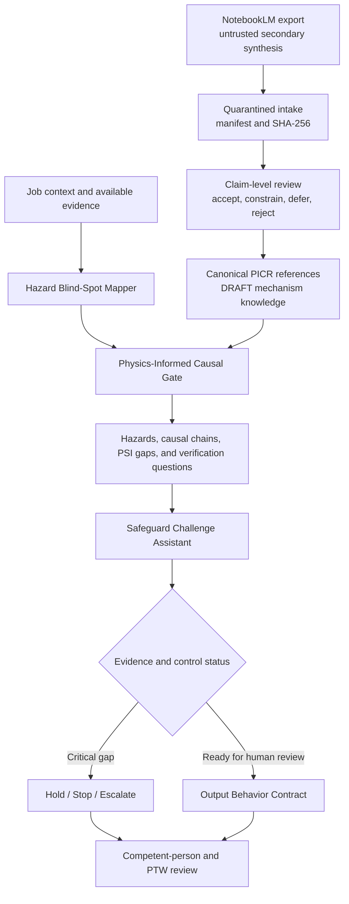

# JSEA

**AI-assisted Job Safety and Environmental Analysis with governed reasoning, evidence discipline, and human accountability**

[ภาษาไทย](./README.th.md) | **English**

## Overview

JSEA is a model-guidance and evaluation project for safety-critical job analysis. It combines two standalone AI skill packages into one review workflow:

1. **Hazard Blind-Spot Mapper** discovers hazards, process-safety information gaps, stored energy, environmental pathways, and work-interface risks.
2. **Safeguard Challenge Assistant** tests whether proposed controls are relevant, layered, independent, supported by evidence, and ready for human field verification.

Both packages now use a shared **Physics-Informed Causal Reasoning Layer (PICR)**. It guides the model to match mechanisms from job-specific preconditions, construct a traceable cause-to-consequence chain, test disconfirming evidence, and map safeguards to the causal edge they actually control.

The project is not a library of prewritten JSA answers. It provides a governed meta-skill architecture that guides a capable foundation model to reason about unfamiliar work, recognize decision-critical unknowns, seek or request evidence, challenge unsupported assumptions, and preserve human authority over safety decisions.

> JSEA supports human-led JSEA and Permit-to-Work review. It does not approve work, issue permits, verify live field conditions, assign a final risk rating, or declare a job safe to proceed.

## Core Thesis

JSEA is designed around a simple principle:

> The system does not need every answer in advance. It must know how to analyze the job, recognize when evidence is insufficient, identify what must be verified, and route the decision to the right human authority.

Its intended reasoning loop is:

```text
Understand -> Decompose -> Check PSI -> Match Preconditions
-> Build and Challenge Causal Chains -> Detect Unknowns
-> Retrieve Evidence -> Reassess -> Escalate -> Communicate
```

## Integrated Architecture



The packages remain independently distributable. When used together, the Mapper establishes the hazard and evidence picture before the Challenge Assistant evaluates proposed safeguards.

## Repository Structure

| Path | Purpose |
|---|---|
| [`jsea-hazard-blind-spot-mapper/`](./jsea-hazard-blind-spot-mapper/) | Hazard discovery, task decomposition, PSI Gate, environmental pathways, and field-verification questions |
| [`jsea-safeguard-challenge-assistant/`](./jsea-safeguard-challenge-assistant/) | Safeguard adequacy, hierarchy, dependency, isolation, evidence, and escalation challenge |
| [`shared-references/`](./shared-references/) | Canonical cross-package rules mirrored into both standalone packages |
| [`From NotebookLM/`](./From%20NotebookLM/) | Original exported knowledge clues retained as untrusted source material; never loaded wholesale as operational policy |
| [`knowledge-intake/`](./knowledge-intake/) | Quarantined source intake, manifests, hashes, and claim-level review decisions |
| [`scripts/`](./scripts/) | Static validation harness for package structure and behavioral test contracts |
| [`JSEA_implementation plan`](./JSEA_implementation%20plan) | Original research basis, architecture, governance requirements, and implementation roadmap |
| [`JSEA_model_reasoning_capability_report.md`](./JSEA_model_reasoning_capability_report.md) | Plain-language and technical explanation of the model reasoning capability |
| [`JSEA_future_development_roadmap.md`](./JSEA_future_development_roadmap.md) | Retrospective, architectural thesis, qualification plan, and future recommendations |
| [`P3.2_physics_informed_causal_reasoning_layer_implementation_report.md`](./P3.2_physics_informed_causal_reasoning_layer_implementation_report.md) | Wave 0-1 implementation evidence, boundaries, and remaining qualification gates |
| [`P3.2_physics_informed_causal_reasoning_layer_plan.md`](./P3.2_physics_informed_causal_reasoning_layer_plan.md) | PICR architecture, acceptance gates, ownership, and staged integration plan |

## The Two Skill Packages

### Hazard Blind-Spot Mapper

Use the Mapper when the primary question is:

- What hazards or environmental pathways may have been missed?
- What process-safety information is required before analysis can continue?
- Which task steps, interfaces, stored energies, or changing conditions need field verification?
- Does a critical unknown require `STOP_AND_ESCALATE`?

See the [Mapper package README](./jsea-hazard-blind-spot-mapper/README.md).

### Safeguard Challenge Assistant

Use the Challenge Assistant when a draft JSEA or proposed safeguards already exist and the primary question is:

- Does each safeguard address the actual hazard mechanism?
- Are controls layered and independent, or do they share a hidden dependency?
- Is the control supported by an approved source and verifiable in the field?
- Is more evidence required before competent-person review?

See the [Safeguard package README](./jsea-safeguard-challenge-assistant/README.md).

## Physics-Informed Causal Reasoning Layer

PICR is not a physics simulator and does not calculate whether equipment or work is safe. It is a bounded reasoning layer that helps the model ask five practical questions:

1. What conditions must be present before this mechanism is plausible?
2. How could the initiating change lead to exposure, loss of containment, or another consequence?
3. What fact would weaken or disprove this mechanism for the current job?
4. What evidence is still needed, and which competent role must interpret it?
5. Which causal edge does each proposed safeguard prevent, inhibit, detect, or mitigate?

Wave 1 contains five reference mechanisms:

| Claim | Mechanism scope |
|---|---|
| `PCR-001` | Thermal expansion of trapped liquid in a blocked or unvented segment |
| `PCR-002` | State-dependent depressurization, flashing, temperature change, and low-temperature material concern |
| `PCR-003` | Accidental mixing and chemical incompatibility |
| `PCR-004` | Exothermic heat generation exceeding heat removal and possible runaway |
| `PCR-005` | Oxygen exposure and self-heating of susceptible pyrophoric iron-sulfide deposits |

### How NotebookLM Knowledge Was Integrated

The NotebookLM export was treated as a collection of research clues, not as authority or executable instructions:

```text
Raw export -> quarantine and hash -> claim-level review
-> verify supporting public sources -> normalize into causal schema
-> add prohibited inferences and human-role boundaries -> evaluation cases
```

All 17 exported files remain preserved with their SHA-256 values. Claims were accepted, constrained, deferred, or rejected individually. Embedded code, automatic approval/veto logic, generic numerical thresholds, chemical recipes, PPE selection, and self-declared validation results were not promoted into operational knowledge.

The five Wave 1 claims remain `REFERENCE` and `DRAFT`. A job-specific conclusion still requires current site facts, approved documents, field evidence, and competent-person review.

## Recommended Combined Workflow

1. Frame the job, boundaries, people, equipment, materials, and operating conditions.
2. Run the Hazard Blind-Spot Mapper and complete the PSI Gate for process-boundary work.
3. Apply the Physics-Informed Causal Gate: match preconditions, build the minimum causal chain, test disconfirming evidence, and assign a support state.
4. Resolve or explicitly record critical evidence gaps before continuing the affected analysis.
5. Prepare or collect the proposed safeguards for each hazard.
6. Run the Safeguard Challenge Assistant and challenge which causal edge each safeguard prevents, detects, inhibits, or mitigates.
7. Convert unresolved critical issues into visible hold points and evidence requests.
8. Render the result and submit it to workers, competent persons, and authorized JSEA/PTW roles for field verification and decision.

Either package may be used independently, but the combined workflow provides stronger traceability from task step to hazard, evidence, safeguard, responsible role, and human decision.

## Evidence and Source Discipline

JSEA distinguishes:

- `FACT`: supplied or verified job information
- `REFERENCE`: information supported by an identified source
- `AI_HYPOTHESIS`: a plausible issue requiring verification
- `EVIDENCE_GAP`: information required before a conclusion can be supported
- `HUMAN_ONLY_DECISION`: a decision reserved for an authorized person

Source precedence is intentional:

```text
Current site-approved documents and field evidence
-> Applicable law and official regulatory sources
-> Recognized technical authorities
-> Generic guidance
-> AI hypothesis
```

Public guidance must not be converted into a site-specific operating instruction without authorized site review.

NotebookLM-derived text sits below this hierarchy as unverified secondary synthesis. It can suggest what to investigate, but only normalized claims with traceable sources and explicit applicability limits enter the canonical PICR catalog.

## Output Profiles

The shared [output behavior contract](./shared-references/jsea-output-behavior-contract.yaml) supports four profiles:

| Profile | Audience and purpose |
|---|---|
| `FIELD_JSA` | Default worker and supervisor report in plain Thai with one hazard-control-PIC mapping per row |
| `MANAGEMENT` | Status, operational consequence, required decisions, and resources |
| `TECHNICAL_REVIEW` | PSI, engineering, occupational hygiene, environmental, isolation, and evidence detail |
| `AUDIT_EVAL` | Rule traceability, expected-versus-observed behavior, and qualification evidence |

Changing the profile changes presentation only. It must not downgrade a finding, remove a hold point, or change the human-authorization boundary.

## Safety and Governance Boundaries

JSEA must not:

- approve JSEA, PTW, isolation, confined-space entry, or work readiness;
- declare work safe or acceptable to proceed;
- replace a site walkdown, gas test, inspection, measurement, or competent-person review;
- invent PPE materials, torque values, test pressures, exposure limits, or acceptance criteria;
- treat generic web guidance as a site-approved procedure;
- suppress a critical concern because of schedule, production, or cost pressure; or
- provide an emergency operating procedure that replaces the approved site Emergency Response Plan.

Site procedures, local legal requirements, and authorized human decisions always take precedence.

## Validation

From the repository root, run:

```powershell
python .\scripts\validate_jsea.py
```

The validator checks JSON evaluation files, YAML/reference structure, declared paths, shared-reference mirror hashes, rule ranges, stale version markers, output-contract requirements, dangling IDs, and the bounded physics-causal schema/policy contract.

At version `1.4.0`, the repository contains 98 evaluation cases across both packages. The structural validation baseline is `0 errors / 0 warnings`.

This is a **static package validator**. It does not call a model, score a generated JSA, or certify engineering correctness. Live semantic evaluation and expert review are part of the next Capability Qualification phase.

See the [validation harness documentation](./scripts/README.md).

## Current Status

- Package version: `1.4.0`
- Implemented through: `P3.2 Physics-Informed Causal Reasoning Layer, Wave 1 foundation`
- Current strengths: PSI and evidence discipline, precondition-based causal reasoning, counterfactual challenge, hazard decomposition, safeguard challenge, escalation, role routing, and audience-aware output
- Qualification boundary: PICR remains `DRAFT`; the 30-case contract is structurally validated but has not yet passed repeated live-model semantic runs or named domain-owner review
- Next recommended phase: `P3.2-Q Semantic Qualification of PICR`

The future plan prioritizes a semantic evaluation runner, an expert-reviewed golden set, a structured analysis object, retrieval provenance, multi-model regression, field comprehension testing, and a controlled site pilot.

## Governance

- **Primary governance:** Process Safety / SSHE leadership with Operations, Occupational Hygiene, Engineering, Maintenance, and PTW participation
- **Shared-reference owner:** SSHE Lead / JSEA Governance Owner
- **Review cycle:** Annual and after relevant incidents, MOC, field feedback, model changes, or communication-related learning
- **Deployment principle:** Qualify a defined capability envelope before expanding to new job families, sites, models, or real-time use

## Important Implementation Note

This repository currently contains AI skill instructions, structured policy references, a DRAFT physics-causal knowledge layer, behavioral evaluation cases, and a static validation harness. It is not yet a standalone application, formal reasoning engine, physics simulator, or deterministic safety calculation engine. Actual response quality depends on the selected model, supplied context, available retrieval tools, source quality, configuration version, and mandatory human review.

## Acknowledgements and Design Sources

JSEA was not derived from one book, standard, or AI-generated summary. Its design combines established process-safety thinking with project-specific governance for an AI assistant. The resulting philosophy is:

- reduce or remove a hazard at its source before relying on added barriers;
- reason from materials, energy, equipment state, work sequence, and failure pathways rather than matching hazard keywords alone;
- treat incidents as outcomes of interacting technical, human, and organizational conditions, not merely an individual unsafe act;
- make missing evidence and uncertainty visible instead of converting assumptions into facts; and
- let AI identify, challenge, and escalate concerns while authorized people retain approval and operational authority.

### Intellectual Foundations

- **Trevor Kletz and Paul Amyotte:** [*Process Plants: A Handbook for Inherently Safer Design*](https://www.routledge.com/Process-Plants-A-Handbook-for-Inherently-Safer-Design-Second-Edition/Kletz-Amyotte/p/book/9781439804551) informs the preference for minimizing, substituting, moderating, and simplifying hazards before adding protective layers.
- **Anna-Mari Heikkila:** [*Inherent Safety in Process Plant Design: An Index-Based Approach* (VTT Publications 384)](https://cris.vtt.fi/en/publications/inherent-safety-in-process-plant-design-an-index-based-approach-d/) reinforces comparison of design alternatives by their inherent hazards. The current JSEA runtime does **not** calculate an Inherent Safety Index or use it as a permit threshold.
- **Frank E. Bird Jr. and George L. Germain:** [*Practical Loss Control Leadership*](https://books.google.com/books/about/Practical_Loss_Control_Leadership.html?id=ZSHgOwAACAAJ) contributed to the broader loss-control tradition of looking beyond immediate acts toward management-system causes. JSEA does **not** treat the `1-10-30-600` ratio as a universal predictive law.
- **Frank Lees:** [*Lees' Loss Prevention in the Process Industries*](https://shop.elsevier.com/books/lees-loss-prevention-in-the-process-industries/lees/978-0-12-397189-0) provides a broad process-industry perspective spanning hazard identification, design, operation, maintenance, and emergency management.
- **CCPS / AIChE:** [Risk-Based Process Safety](https://www.aiche.org/ili/academy/courses/ela120/20-elements-risk-based-process-safety-rbps) supplies the four-pillar, twenty-element management-system perspective: commit to process safety, understand hazards and risk, manage risk, and learn from experience.
- **US OSHA:** [29 CFR 1910.119 Process Safety Management](https://www.osha.gov/laws-regs/regulations/standardnumber/1910/1910.119) anchors process safety information, process hazard analysis, safe work practices, mechanical integrity, management of change, and competent team review where its jurisdiction or site adoption applies.

These works are acknowledged as influences. Their inclusion does not mean that every equation, incident ratio, score, threshold, or recommendation in them has been encoded in JSEA.

### PICR Wave 1 Technical Anchors

The current Physics-Informed Causal Reasoning Layer uses bounded, claim-level support from primary or official sources:

| Reasoning topic | Source used by the project | Use boundary |
|---|---|---|
| Isolation, trapped pressure, draining, and venting | [UK HSE HSG253](https://books.hse.gov.uk/gempdf/hsg253.pdf) | Generic isolation principles; not a site isolation class or procedure |
| State-dependent Joule-Thomson behavior | [NIST Technical Note 227](https://www.nist.gov/publications/joule-thomson-process-cryogenic-refrigeration-systems) | Mechanism anchor; not a job-specific depressurization or MDMT calculation |
| Chemical identity, incompatibility, and mixing pathways | [NOAA CAMEO Chemical Reactivity Worksheet](https://response.restoration.noaa.gov/oil-and-chemical-spills/chemical-spills/chemical-reactivity-worksheet) and [OSHA Chemical Reactivity Hazard Evaluation](https://www.osha.gov/chemical-reactivity/hazard-evaluation) | Screening and evidence prompts; not final compatibility approval |
| Runaway reaction and heat-removal failure | [US CSB T2 Laboratories investigation](https://www.csb.gov/assets/1/20/t2_final_copy_9_17_09.pdf?13900=) | Incident-derived causal learning; not universal design limits |
| Pyrophoric deposits, oxygen exposure, and self-heating | [US CSB Husky Superior Refinery investigation](https://www.csb.gov/assets/1/20/husky_superior_refinery_report_2022-12-23_%281%291.pdf?16884=) and [OSHA Petroleum Refining Technical Manual](https://www.osha.gov/otm/section-4-safety-hazards/chapter-2) | Candidate mechanism and evidence request; not a decontamination recipe |

The complete source metadata, supported claims, limitations, and review dates are maintained in the [Physics-Causal Source Register](./shared-references/physics-causal-source-register.yaml).

### Knowledge Provenance and Attribution Boundary

The project gratefully acknowledges **NotebookLM**, **Gemini Deep Research**, and **Google AI** as discovery and synthesis aids used to assemble candidate knowledge and locate possible source material. Their outputs are treated as unverified secondary synthesis, not as standards, authorities, or proof. Candidate claims are quarantined, hashed, reviewed, normalized, and linked to traceable sources before they can enter the canonical PICR catalog; rejected claims remain excluded.

Acknowledgement does not imply endorsement by any named author, publisher, regulator, standards body, or AI provider. Public references do not replace applicable law, current site-approved documents, equipment-specific engineering data, field measurements, or review and authorization by competent people.
