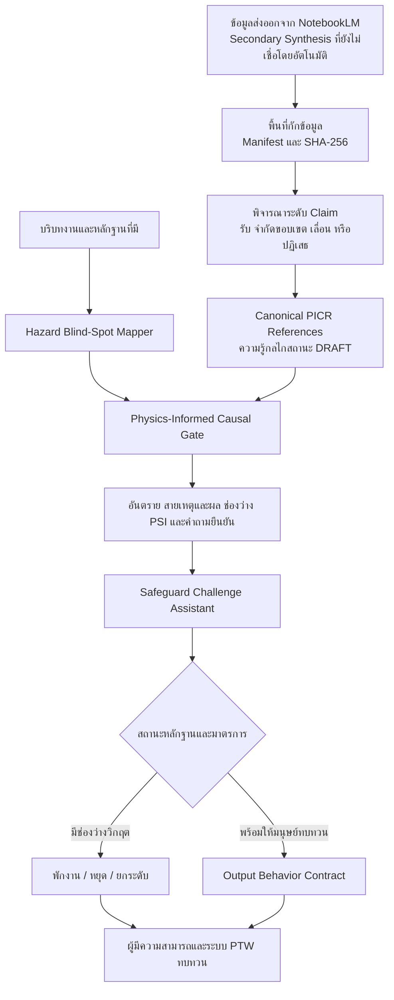

# JSEA

**ระบบ AI ช่วยวิเคราะห์ความปลอดภัยและสิ่งแวดล้อมในการทำงาน ภายใต้กรอบการให้เหตุผล หลักฐาน และความรับผิดชอบของมนุษย์**

**ภาษาไทย** | [English](./README.md)

## ภาพรวม

JSEA เป็นโครงการกำกับและประเมินโมเดล AI สำหรับการวิเคราะห์งานที่มีผลต่อความปลอดภัย ระบบเชื่อมสองชุดคำสั่งที่ยังสามารถแจกและใช้งานแยกกันได้ให้เป็น Workflow เดียว:

1. **Hazard Blind-Spot Mapper** ช่วยค้นหาอันตราย ข้อมูล Process Safety ที่ขาด พลังงานตกค้าง เส้นทางผลกระทบต่อสิ่งแวดล้อม และความเสี่ยงตรงรอยต่อของงาน
2. **Safeguard Challenge Assistant** ช่วยตรวจว่ามาตรการควบคุมตรงกับอันตราย มีหลายชั้น เป็นอิสระ มีหลักฐาน และพร้อมให้ผู้มีความสามารถตรวจสอบหน้างานหรือไม่

ปัจจุบันทั้งสอง Package ใช้ **Physics-Informed Causal Reasoning Layer (PICR)** ร่วมกัน Layer นี้กำกับให้โมเดลเลือกกลไกจากเงื่อนไขจริงของงาน สร้างสายเหตุไปถึงผล ตรวจหลักฐานที่อาจหักล้างสมมติฐาน และทดสอบว่ามาตรการแต่ละข้อควบคุมจุดใดของสายเหตุและผล

โครงการนี้ไม่ใช่คลังคำตอบ JSA สำเร็จรูป แต่เป็น Governed Meta-skill Architecture ที่กำกับให้ Foundation Model ที่มีความสามารถสามารถวิเคราะห์งานที่ไม่คุ้นเคย รู้ว่าข้อมูลสำคัญใดยังขาด ค้นหรือขอหลักฐาน ท้าทายสมมติฐานที่ไม่มีแหล่งรองรับ และรักษาอำนาจตัดสินใจด้านความปลอดภัยไว้กับมนุษย์

> JSEA สนับสนุนการทบทวน JSEA และ Permit to Work ที่มีมนุษย์เป็นผู้รับผิดชอบ ระบบไม่อนุมัติงาน ไม่ออกใบอนุญาต ไม่ยืนยันสภาพหน้างานจริง ไม่กำหนด Final Risk Rating และไม่ประกาศว่างานปลอดภัยให้เริ่มได้

## Thesis หลักของโครงการ

JSEA ถูกออกแบบบนหลักการง่าย ๆ:

> ระบบไม่จำเป็นต้องรู้ทุกคำตอบล่วงหน้า แต่ต้องรู้ว่าจะวิเคราะห์งานอย่างไร รู้เมื่อหลักฐานยังไม่พอ ระบุสิ่งที่ต้องยืนยัน และส่งการตัดสินใจกลับไปยังมนุษย์ผู้มีอำนาจที่ถูกต้อง

วงจรการให้เหตุผลที่ต้องการคือ:

```text
ทำความเข้าใจ -> แบ่งงาน -> ตรวจ PSI -> ตรวจเงื่อนไขก่อนเกิดเหตุ
-> สร้างและท้าทายสายเหตุและผล -> ตรวจสิ่งที่ยังไม่รู้
-> ค้นหลักฐาน -> ประเมินใหม่ -> ยกระดับ -> สื่อสาร
```

## สถาปัตยกรรมแบบเชื่อมต่อ



ทั้งสอง package ยังคงใช้งานแยกกันได้ เมื่อนำมาใช้ร่วมกัน Mapper จะสร้างภาพรวมอันตรายและหลักฐานก่อนที่ Challenge Assistant จะตรวจความเพียงพอของมาตรการควบคุม

## โครงสร้าง Repository

| Path | หน้าที่ |
|---|---|
| [`jsea-hazard-blind-spot-mapper/`](./jsea-hazard-blind-spot-mapper/) | ค้นหาอันตราย แบ่งขั้นตอนงาน ตรวจ PSI เส้นทางสิ่งแวดล้อม และสร้างคำถามยืนยันหน้างาน |
| [`jsea-safeguard-challenge-assistant/`](./jsea-safeguard-challenge-assistant/) | ท้าทายความเพียงพอ ลำดับชั้น ความเป็นอิสระ Isolation หลักฐาน และการยกระดับมาตรการ |
| [`shared-references/`](./shared-references/) | กฎกลางที่เป็น Canonical Source และถูกคัดลอกไปใน package ทั้งสองเพื่อให้แจกแยกได้ |
| [`From NotebookLM/`](./From%20NotebookLM/) | ข้อมูลความรู้ที่ส่งออกมาตั้งต้น เก็บไว้เป็นเบาะแสที่ยังไม่เชื่อเป็นกฎและไม่นำเข้า Operational Policy ทั้งชุด |
| [`knowledge-intake/`](./knowledge-intake/) | พื้นที่กักข้อมูลนำเข้า Manifest, hash และผลพิจารณาระดับ claim ก่อนเลื่อนชั้นเป็นความรู้ระบบ |
| [`scripts/`](./scripts/) | Static validation harness สำหรับโครงสร้าง package และสัญญาพฤติกรรม |
| [`JSEA_implementation plan`](./JSEA_implementation%20plan) | งานวิจัยตั้งต้น สถาปัตยกรรม ข้อกำกับ และแผนการพัฒนา |
| [`JSEA_model_reasoning_capability_report.md`](./JSEA_model_reasoning_capability_report.md) | รายงานความสามารถในการให้เหตุผลสำหรับบุคคลทั่วไปและ AI Engineer |
| [`JSEA_future_development_roadmap.md`](./JSEA_future_development_roadmap.md) | บทเรียนย้อนหลัง Thesis เชิงสถาปัตยกรรม และข้อเสนอการพัฒนาในอนาคต |
| [`P3.2_physics_informed_causal_reasoning_layer_implementation_report.md`](./P3.2_physics_informed_causal_reasoning_layer_implementation_report.md) | หลักฐานการติดตั้ง Wave 0-1 ขอบเขตการใช้งาน และเงื่อนไขที่ยังต้องผ่านก่อนเลื่อนสถานะ |
| [`P3.2_physics_informed_causal_reasoning_layer_plan.md`](./P3.2_physics_informed_causal_reasoning_layer_plan.md) | สถาปัตยกรรม PICR, Acceptance Gates, Ownership และแผนบูรณาการเป็นลำดับ |

## สอง Skill หลัก

### Hazard Blind-Spot Mapper

ใช้ Mapper เมื่อคำถามหลักคือ:

- มีอันตรายหรือเส้นทางสิ่งแวดล้อมใดถูกมองข้ามหรือไม่
- ต้องมีข้อมูล Process Safety อะไรก่อนจึงจะวิเคราะห์ต่อได้
- ขั้นตอน รอยต่อ พลังงานตกค้าง หรือสภาวะเปลี่ยนแปลงใดต้องยืนยันหน้างาน
- มี Critical Unknown ที่ต้อง `STOP_AND_ESCALATE` หรือไม่

อ่านรายละเอียดใน [README ของ Mapper](./jsea-hazard-blind-spot-mapper/README.md)

### Safeguard Challenge Assistant

ใช้ Challenge Assistant เมื่อมีร่าง JSEA หรือมาตรการควบคุมแล้ว และคำถามหลักคือ:

- แต่ละมาตรการตอบกลไกอันตรายจริงหรือไม่
- มาตรการมีหลายชั้นและเป็นอิสระ หรือมี Hidden Dependency ร่วมกัน
- มาตรการมีแหล่งอนุมัติและตรวจสอบหน้างานได้หรือไม่
- ต้องขอหลักฐานเพิ่มก่อนส่งให้ผู้มีความสามารถทบทวนหรือไม่

อ่านรายละเอียดใน [README ของ Safeguard Challenge Assistant](./jsea-safeguard-challenge-assistant/README.md)

## Physics-Informed Causal Reasoning Layer

PICR ไม่ใช่เครื่องจำลองฟิสิกส์และไม่ได้คำนวณตัดสินว่าอุปกรณ์หรืองานปลอดภัย แต่เป็น Layer กำกับการให้เหตุผลให้โมเดลถามห้าเรื่อง:

1. ต้องมีเงื่อนไขใดก่อน กลไกนี้จึงเป็นไปได้ในงานปัจจุบัน
2. การเปลี่ยนแปลงเริ่มต้นจะนำไปสู่การสัมผัส การสูญเสียการกักเก็บ หรือผลอื่นได้อย่างไร
3. ข้อเท็จจริงใดจะทำให้กลไกนี้อ่อนลงหรือใช้ไม่ได้กับงานนี้
4. ยังต้องใช้หลักฐานอะไร และผู้มีความสามารถบทบาทใดต้องตีความ
5. มาตรการแต่ละข้อป้องกัน ยับยั้ง ตรวจจับ หรือลดผลที่จุดใดของสายเหตุและผล

Wave 1 มี Reference Mechanism ห้ากลุ่ม:

| Claim | ขอบเขตกลไก |
|---|---|
| `PCR-001` | ของเหลวถูกกักในช่วงท่อปิดหรือไม่มีทางระบาย แล้วขยายตัวเมื่อได้รับความร้อน |
| `PCR-002` | Depressurization, Flashing, การเปลี่ยนอุณหภูมิตามสภาวะ และข้อกังวลต่อวัสดุที่อุณหภูมิต่ำ |
| `PCR-003` | การผสมสารโดยไม่ตั้งใจและ Chemical Incompatibility |
| `PCR-004` | ความร้อนจากปฏิกิริยามากกว่าความสามารถระบายความร้อนและการเกิด Runaway |
| `PCR-005` | ตะกอน Iron Sulfide ที่ไวต่อการลุกติด สัมผัสออกซิเจนและเกิด Self-heating |

### วิธีนำความรู้จาก NotebookLM เข้าระบบ

ข้อมูลจาก NotebookLM ถูกถือเป็นเบาะแสสำหรับการวิจัย ไม่ใช่ Authority หรือคำสั่งที่นำไปรันได้ทันที:

```text
ข้อมูลส่งออก -> กักและทำ Hash -> พิจารณาทีละ Claim
-> ตรวจแหล่งสาธารณะที่รองรับ -> แปลงเข้า Causal Schema
-> เพิ่มสิ่งที่ห้ามอนุมานและขอบเขตอำนาจมนุษย์ -> สร้างบทสอบ
```

ไฟล์ส่งออกทั้ง 17 ไฟล์ยังถูกเก็บพร้อมค่า SHA-256 โดยแต่ละ Claim ถูกตัดสินแยกเป็นรับ จำกัดขอบเขต เลื่อน หรือปฏิเสธ Code ที่ฝังมา, Logic อนุมัติหรือ Veto อัตโนมัติ, ตัวเลขทั่วไปที่ไม่มี Applicability, สูตรเคมี, การเลือก PPE และผล Self-validation ไม่ถูกเลื่อนเป็น Operational Knowledge

Claim ทั้งห้าใน Wave 1 ยังคงมีสถานะ `REFERENCE` และ `DRAFT` การสรุปสำหรับงานจริงยังต้องใช้ข้อเท็จจริงล่าสุดของโรงงาน เอกสารที่อนุมัติ หลักฐานหน้างาน และการทบทวนจากผู้มีความสามารถ

## Workflow ที่แนะนำเมื่อใช้ร่วมกัน

1. กำหนดขอบเขตงาน พื้นที่ คน อุปกรณ์ สารเคมี และสภาวะการทำงาน
2. ใช้ Hazard Blind-Spot Mapper และทำ PSI Gate สำหรับงานที่เปิด Process Boundary
3. ใช้ Physics-Informed Causal Gate ตรวจเงื่อนไขก่อนเกิดเหตุ สร้างสายเหตุและผล ทดสอบหลักฐานที่หักล้าง และกำหนดสถานะความน่าเชื่อถือ
4. ปิดช่องว่างหลักฐานวิกฤต หรือบันทึกสถานะอย่างชัดเจนก่อนวิเคราะห์ส่วนที่ได้รับผลกระทบต่อ
5. เตรียมหรือรวบรวมมาตรการควบคุมสำหรับแต่ละอันตราย
6. ใช้ Safeguard Challenge Assistant ตรวจว่ามาตรการแต่ละข้อป้องกัน ตรวจจับ ยับยั้ง หรือลดผลที่จุดใดของสายเหตุและผล
7. เปลี่ยนประเด็นสำคัญที่ยังไม่ปิดเป็น Hold Point และรายการหลักฐานที่ต้องขอ
8. จัดรูปผลลัพธ์และส่งให้คนทำงาน ผู้มีความสามารถ และผู้มีอำนาจตามระบบ JSEA/PTW ตรวจหน้างานและตัดสินใจ

สามารถใช้แต่ละ package แยกกันได้ แต่ Workflow รวมช่วยรักษาความเชื่อมโยงตั้งแต่ขั้นตอนงาน อันตราย หลักฐาน มาตรการ ผู้รับผิดชอบ จนถึงการตัดสินใจของมนุษย์

## วินัยด้านหลักฐานและแหล่งข้อมูล

JSEA แยกข้อมูลเป็น:

- `FACT`: ข้อมูลงานที่ผู้ใช้ให้หรือได้รับการยืนยัน
- `REFERENCE`: ข้อมูลที่มีแหล่งอ้างอิงระบุชัด
- `AI_HYPOTHESIS`: ประเด็นที่เป็นไปได้และต้องยืนยัน
- `EVIDENCE_GAP`: ข้อมูลที่จำเป็นก่อนรองรับข้อสรุปได้
- `HUMAN_ONLY_DECISION`: การตัดสินใจที่สงวนไว้สำหรับผู้มีอำนาจ

ลำดับความสำคัญของแหล่งข้อมูลคือ:

```text
เอกสารปัจจุบันที่โรงงานอนุมัติและหลักฐานหน้างาน
-> กฎหมายที่เกี่ยวข้องและแหล่งราชการ
-> องค์กรวิชาการหรือมาตรฐานที่ยอมรับ
-> คำแนะนำทั่วไป
-> สมมติฐานของ AI
```

ห้ามเปลี่ยนคำแนะนำสาธารณะให้เป็นวิธีปฏิบัติเฉพาะโรงงานโดยไม่มีผู้มีอำนาจของโรงงานทบทวน

ข้อความที่มาจาก NotebookLM อยู่ต่ำกว่าลำดับแหล่งข้อมูลข้างต้นในฐานะ Secondary Synthesis ที่ยังไม่ยืนยัน ใช้ชี้ทางการค้นได้ แต่เฉพาะ Claim ที่ถูก Normalize มีแหล่งตรวจสอบย้อนกลับ และมีขอบเขตการใช้ชัดเจนเท่านั้นที่เข้าสู่ Canonical PICR Catalog

## รูปแบบผลลัพธ์

[Output Behavior Contract](./shared-references/jsea-output-behavior-contract.yaml) รองรับสี่รูปแบบ:

| Profile | ผู้รับสารและวัตถุประสงค์ |
|---|---|
| `FIELD_JSA` | รูปแบบเริ่มต้นสำหรับคนหน้างานและหัวหน้างาน ใช้ภาษาไทยทั่วไปและจับคู่ Hazard-Control-PIC หนึ่งต่อหนึ่ง |
| `MANAGEMENT` | สถานะ ผลกระทบต่อการปฏิบัติงาน การตัดสินใจ และทรัพยากรที่ต้องการ |
| `TECHNICAL_REVIEW` | รายละเอียด PSI, Engineering, Occupational Hygiene, Environmental, Isolation และหลักฐาน |
| `AUDIT_EVAL` | Rule traceability, expected-versus-observed behavior และหลักฐาน Qualification |

การเปลี่ยน Profile เปลี่ยนเฉพาะวิธีนำเสนอ ห้ามลดระดับข้อค้นพบ ลบ Hold Point หรือเปลี่ยนขอบเขตอำนาจของมนุษย์

## ขอบเขตด้านความปลอดภัยและ Governance

JSEA ต้องไม่:

- อนุมัติ JSEA, PTW, Isolation, Confined-space Entry หรือความพร้อมเริ่มงาน
- ประกาศว่างานปลอดภัยหรือยอมรับให้ดำเนินการต่อได้
- แทนการ Walkdown, Gas Test, Inspection, Measurement หรือการตรวจของผู้มีความสามารถ
- แต่งชนิด PPE, ค่า Torque, Test Pressure, Exposure Limit หรือ Acceptance Criteria
- ใช้คำแนะนำจากเว็บทั่วไปเป็น Site-approved Procedure
- ลดความรุนแรงของประเด็นเพราะแรงกดดันด้านเวลา การผลิต หรือต้นทุน
- สร้างวิธีตอบโต้เหตุฉุกเฉินแทน Site Emergency Response Plan ที่อนุมัติแล้ว

Site Procedure, กฎหมายท้องถิ่น และการตัดสินใจของมนุษย์ผู้มีอำนาจมีลำดับสูงกว่าเสมอ

## การตรวจสอบ Repository

รันจาก Root Folder:

```powershell
python .\scripts\validate_jsea.py
```

Validator ตรวจไฟล์ JSON eval, โครงสร้าง YAML/reference, path ที่ประกาศไว้, hash ของ shared-reference mirrors, ช่วง Rule ID, version เก่า, ข้อกำหนดของ Output Contract, ID ที่อ้างถึงแต่ไม่มีอยู่จริง และสัญญาโครงสร้างของ Physics-Informed Causal Layer

ในเวอร์ชัน `1.4.0` repository มี evaluation cases รวม 98 เคส และ Structural Validation Baseline คือ `0 errors / 0 warnings`

นี่คือ **Static Package Validator** ซึ่งไม่ได้เรียกโมเดล ไม่ให้คะแนนรายงาน JSA ที่โมเดลสร้าง และไม่รับรองความถูกต้องทางวิศวกรรม Live semantic evaluation และการประเมินโดยผู้เชี่ยวชาญอยู่ใน Capability Qualification ขั้นถัดไป

อ่านรายละเอียดใน [Validation Harness Documentation](./scripts/README.md)

## สถานะปัจจุบัน

- Package version: `1.4.0`
- ดำเนินการแล้วถึง: `P3.2 Physics-Informed Causal Reasoning Layer, Wave 1 foundation`
- จุดแข็งปัจจุบัน: PSI และ Evidence Discipline, การให้เหตุผลจากเงื่อนไขและกลไก, Counterfactual Challenge, Hazard Decomposition, Safeguard Challenge, Escalation, Role Routing และ Audience-aware Output
- ขอบเขตการรับรอง: PICR ยังเป็น `DRAFT`; บทสอบ 30 เคสผ่านการตรวจโครงสร้างแล้ว แต่ยังไม่ผ่านการรัน Semantic Evaluation ซ้ำกับโมเดลจริงและการทบทวนโดย Domain Owner ที่ระบุชื่อ
- ขั้นต่อไปที่แนะนำ: `P3.2-Q Semantic Qualification of PICR`

แผนในอนาคตให้ความสำคัญกับ Semantic Evaluation Runner, Golden Set ที่ผู้เชี่ยวชาญทบทวน, Structured Analysis Object, Retrieval Provenance, Multi-model Regression, Field Comprehension Testing และ Controlled Site Pilot

## Governance

- **ผู้กำกับหลัก:** Process Safety / SSHE ร่วมกับ Operations, Occupational Hygiene, Engineering, Maintenance และ PTW
- **เจ้าของ Shared References:** SSHE Lead / JSEA Governance Owner
- **รอบทบทวน:** รายปี และหลัง Incident, MOC, Field Feedback, Model Change หรือบทเรียนด้านการสื่อสารที่เกี่ยวข้อง
- **หลักการนำไปใช้:** ต้อง Qualification ขอบเขตความสามารถที่กำหนดก่อนขยายไปยัง Job Family, Site, Model หรือการใช้งาน Real-time ใหม่

## หมายเหตุสำคัญด้านการพัฒนา

ปัจจุบัน repository นี้ประกอบด้วยคำสั่งสำหรับ AI, Structured Policy References, Physics-Causal Knowledge Layer สถานะ DRAFT, Behavioral Evaluation Cases และ Static Validation Harness ยังไม่ใช่ Standalone Application, Formal Reasoning Engine, Physics Simulator หรือ Deterministic Safety Calculation Engine คุณภาพคำตอบจริงขึ้นกับรุ่นโมเดล บริบทที่ให้ เครื่องมือค้นข้อมูล คุณภาพแหล่งข้อมูล เวอร์ชัน Configuration และการทบทวนโดยมนุษย์ที่ยังคงบังคับใช้

## กิตติกรรมประกาศและแหล่งที่มาของแนวคิดการออกแบบ

JSEA ไม่ได้สร้างขึ้นจากหนังสือ มาตรฐาน หรือคำสรุปของ AI แหล่งใดเพียงแหล่งเดียว แต่ผสานแนวคิดด้านความปลอดภัยกระบวนการที่ได้รับการยอมรับเข้ากับ Governance ที่โครงการกำหนดขึ้นสำหรับผู้ช่วย AI จนเป็นปรัชญาการทำงานดังนี้:

- ลดหรือขจัดอันตรายที่ต้นเหตุก่อนพึ่งชั้นป้องกันที่เพิ่มเข้าไป
- ให้เหตุผลจากสารเคมี พลังงาน สถานะอุปกรณ์ ลำดับงาน และเส้นทางการเกิดเหตุ ไม่ใช่จับคู่จากคำสำคัญของอันตรายเท่านั้น
- มองอุบัติการณ์เป็นผลจากเงื่อนไขทางเทคนิค มนุษย์ และระบบองค์กรที่ทำงานร่วมกัน ไม่ใช่โทษการกระทำของบุคคลเพียงอย่างเดียว
- แสดงข้อมูลที่ขาดและความไม่แน่นอนอย่างตรงไปตรงมา แทนการเปลี่ยนสมมติฐานให้เป็นข้อเท็จจริง
- ให้ AI ช่วยค้นหา ตั้งคำถาม และยกระดับข้อกังวล โดยผู้มีอำนาจยังคงเป็นผู้อนุมัติและตัดสินใจด้านการปฏิบัติงาน

### รากฐานทางความคิด

- **Trevor Kletz และ Paul Amyotte:** [*Process Plants: A Handbook for Inherently Safer Design*](https://www.routledge.com/Process-Plants-A-Handbook-for-Inherently-Safer-Design-Second-Edition/Kletz-Amyotte/p/book/9781439804551) เป็นรากฐานของการลดปริมาณ ทดแทน ลดความรุนแรง และทำระบบให้ง่าย ก่อนเพิ่มชั้นป้องกัน
- **Anna-Mari Heikkila:** [*Inherent Safety in Process Plant Design: An Index-Based Approach* (VTT Publications 384)](https://cris.vtt.fi/en/publications/inherent-safety-in-process-plant-design-an-index-based-approach-d/) สนับสนุนการเปรียบเทียบทางเลือกการออกแบบจากอันตรายที่มีอยู่ในตัวกระบวนการ ปัจจุบัน JSEA **ไม่ได้** คำนวณ Inherent Safety Index หรือใช้คะแนนดังกล่าวเป็นเกณฑ์อนุญาตงาน
- **Frank E. Bird Jr. และ George L. Germain:** [*Practical Loss Control Leadership*](https://books.google.com/books/about/Practical_Loss_Control_Leadership.html?id=ZSHgOwAACAAJ) มีอิทธิพลต่อแนวคิด Loss Control ที่มองลึกกว่าการกระทำเฉพาะหน้าไปถึงเหตุจากระบบบริหาร แต่ JSEA **ไม่ได้** ถืออัตราส่วน `1-10-30-600` เป็นกฎทำนายที่ใช้ได้กับทุกองค์กร
- **Frank Lees:** [*Lees' Loss Prevention in the Process Industries*](https://shop.elsevier.com/books/lees-loss-prevention-in-the-process-industries/lees/978-0-12-397189-0) ให้ภาพรวมด้าน Loss Prevention ของอุตสาหกรรมกระบวนการ ตั้งแต่การระบุอันตราย การออกแบบ การเดินระบบ การบำรุงรักษา จนถึงการจัดการเหตุฉุกเฉิน
- **CCPS / AIChE:** [Risk-Based Process Safety](https://www.aiche.org/ili/academy/courses/ela120/20-elements-risk-based-process-safety-rbps) ให้มุมมองระบบบริหาร 4 เสาหลัก 20 องค์ประกอบ ได้แก่ มุ่งมั่นต่อความปลอดภัยกระบวนการ เข้าใจอันตรายและความเสี่ยง จัดการความเสี่ยง และเรียนรู้จากประสบการณ์
- **US OSHA:** [29 CFR 1910.119 Process Safety Management](https://www.osha.gov/laws-regs/regulations/standardnumber/1910/1910.119) เป็นหลักอ้างอิงเรื่อง Process Safety Information, Process Hazard Analysis, Safe Work Practices, Mechanical Integrity, Management of Change และการทบทวนโดยทีมที่มีความสามารถ เมื่อกฎหมายสหรัฐหรือข้อกำหนดของโรงงานนั้นนำมาใช้

การกล่าวถึงผลงานเหล่านี้คือการให้เครดิตในฐานะแหล่งอิทธิพล ไม่ได้หมายความว่าสมการ อัตราส่วน คะแนน เกณฑ์ตัวเลข หรือคำแนะนำทุกข้อในแหล่งเหล่านั้นถูกนำมาเขียนเป็นกฎของ JSEA

### แหล่งหลักฐานทางเทคนิคของ PICR Wave 1

Physics-Informed Causal Reasoning Layer รุ่นปัจจุบันใช้แหล่งข้อมูลปฐมภูมิหรือแหล่งทางการเพื่อรองรับ Claim อย่างมีขอบเขต:

| ประเด็นการให้เหตุผล | แหล่งที่โครงการใช้ | ขอบเขตการใช้ |
|---|---|---|
| การตัดแยก แรงดันค้าง การระบายของเหลว และการ Vent | [UK HSE HSG253](https://books.hse.gov.uk/gempdf/hsg253.pdf) | ใช้เป็นหลักทั่วไป ไม่ใช่ประเภท Isolation หรือวิธีปฏิบัติเฉพาะโรงงาน |
| พฤติกรรม Joule-Thomson ที่ขึ้นกับสถานะของสาร | [NIST Technical Note 227](https://www.nist.gov/publications/joule-thomson-process-cryogenic-refrigeration-systems) | ใช้ยืนยันกลไก ไม่ใช่ผลคำนวณ Depressurization หรือ MDMT ของงานใดงานหนึ่ง |
| เอกลักษณ์สาร ความเข้ากันไม่ได้ และเส้นทางการผสม | [NOAA CAMEO Chemical Reactivity Worksheet](https://response.restoration.noaa.gov/oil-and-chemical-spills/chemical-spills/chemical-reactivity-worksheet) และ [OSHA Chemical Reactivity Hazard Evaluation](https://www.osha.gov/chemical-reactivity/hazard-evaluation) | ใช้ Screening และตั้งคำถามหาหลักฐาน ไม่ใช่อนุมัติ Compatibility ขั้นสุดท้าย |
| ปฏิกิริยารันอะเวย์และความล้มเหลวของการระบายความร้อน | [รายงานสอบสวน T2 Laboratories ของ US CSB](https://www.csb.gov/assets/1/20/t2_final_copy_9_17_09.pdf?13900=) | ใช้เรียนรู้สายเหตุจากอุบัติการณ์ ไม่ใช่ค่าจำกัดการออกแบบสากล |
| ตะกอน Pyrophoric การสัมผัสออกซิเจน และการเกิดความร้อนเอง | [รายงานสอบสวน Husky Superior Refinery ของ US CSB](https://www.csb.gov/assets/1/20/husky_superior_refinery_report_2022-12-23_%281%291.pdf?16884=) และ [OSHA Petroleum Refining Technical Manual](https://www.osha.gov/otm/section-4-safety-hazards/chapter-2) | ใช้เป็นกลไกที่อาจเกิดและคำถามหาหลักฐาน ไม่ใช่สูตร Decontamination |

Metadata, Claim ที่รองรับ, ข้อจำกัด และวันที่ทบทวนของแต่ละแหล่งอยู่ใน [Physics-Causal Source Register](./shared-references/physics-causal-source-register.yaml)

### ที่มาของความรู้และขอบเขตการให้เครดิต

โครงการขอขอบคุณ **NotebookLM**, **Gemini Deep Research** และ **Google AI** ที่ช่วยรวบรวมและสังเคราะห์ความรู้ตั้งต้น รวมถึงชี้เบาะแสไปยังแหล่งข้อมูลที่ควรตรวจสอบ ผลลัพธ์จากเครื่องมือเหล่านี้ถือเป็น Secondary Synthesis ที่ยังไม่ยืนยัน ไม่ใช่มาตรฐาน แหล่งอำนาจ หรือหลักฐานในตัวเอง ทุก Candidate Claim ต้องถูกกักแยก บันทึก Hash ทบทวน Normalize และเชื่อมกับแหล่งที่ตรวจสอบย้อนกลับได้ก่อนเข้าสู่ Canonical PICR Catalog ส่วน Claim ที่ไม่ผ่านยังคงถูกกันออกจากระบบ

กิตติกรรมประกาศนี้ไม่ได้หมายความว่าผู้เขียน สำนักพิมพ์ หน่วยงานกำกับ องค์กรมาตรฐาน หรือผู้ให้บริการ AI ที่กล่าวถึงให้การรับรองโครงการ แหล่งข้อมูลสาธารณะไม่แทนกฎหมายที่ใช้บังคับ เอกสารโรงงานฉบับปัจจุบัน ข้อมูลวิศวกรรมเฉพาะอุปกรณ์ ผลตรวจวัดหน้างาน หรือการทบทวนและอนุมัติโดยผู้มีความสามารถ
